Mini Data-Analysis Deliverable 1
================

# Welcome to your (maybe) first-ever data analysis project!

And hopefully the first of many. Let’s get started:

1.  Install the [`datateachr`](https://github.com/UBC-MDS/datateachr)
    package by typing the following into your **R terminal**:

<!-- -->

    install.packages("devtools")
    devtools::install_github("UBC-MDS/datateachr")

2.  Load the packages below.

``` r
library(datateachr)
library(tidyverse)
```

    ## ── Attaching packages ─────────────────────────────────────── tidyverse 1.3.2 ──
    ## ✔ ggplot2 3.3.6      ✔ purrr   0.3.4 
    ## ✔ tibble  3.1.8      ✔ dplyr   1.0.10
    ## ✔ tidyr   1.2.1      ✔ stringr 1.4.1 
    ## ✔ readr   2.1.3      ✔ forcats 0.5.2 
    ## ── Conflicts ────────────────────────────────────────── tidyverse_conflicts() ──
    ## ✖ dplyr::filter() masks stats::filter()
    ## ✖ dplyr::lag()    masks stats::lag()

3.  Make a repository in the <https://github.com/stat545ubc-2022>
    Organization. You will be working with this repository for the
    entire data analysis project. You can either make it public, or make
    it private and add the TA’s and Lucy as collaborators. A link to
    help you create a private repository is available on the
    \#collaborative-project Slack channel.

# Instructions

## For Both Milestones

-   Each milestone is worth 45 points. The number of points allocated to
    each task will be annotated within each deliverable. Tasks that are
    more challenging will often be allocated more points.

-   10 points will be allocated to the reproducibility, cleanliness, and
    coherence of the overall analysis. While the two milestones will be
    submitted as independent deliverables, the analysis itself is a
    continuum - think of it as two chapters to a story. Each chapter, or
    in this case, portion of your analysis, should be easily followed
    through by someone unfamiliar with the content.
    [Here](https://swcarpentry.github.io/r-novice-inflammation/06-best-practices-R/)
    is a good resource for what constitutes “good code”. Learning good
    coding practices early in your career will save you hassle later on!

## For Milestone 1

**To complete this milestone**, edit [this very `.Rmd`
file](https://raw.githubusercontent.com/UBC-STAT/stat545.stat.ubc.ca/master/content/mini-project/mini-project-1.Rmd)
directly. Fill in the sections that are tagged with
`<!--- start your work below --->`.

**To submit this milestone**, make sure to knit this `.Rmd` file to an
`.md` file by changing the YAML output settings from
`output: html_document` to `output: github_document`. Commit and push
all of your work to the mini-analysis GitHub repository you made
earlier, and tag a release on GitHub. Then, submit a link to your tagged
release on canvas.

**Points**: This milestone is worth 45 points: 43 for your analysis, 1
point for having your Milestone 1 document knit error-free, and 1 point
for tagging your release on Github.

# Learning Objectives

By the end of this milestone, you should:

-   Become familiar with your dataset of choosing
-   Select 4 questions that you would like to answer with your data
-   Generate a reproducible and clear report using R Markdown
-   Become familiar with manipulating and summarizing your data in
    tibbles using `dplyr`, with a research question in mind.

# Task 1: Choose your favorite dataset (10 points)

The `datateachr` package by Hayley Boyce and Jordan Bourak currently
composed of 7 semi-tidy datasets for educational purposes. Here is a
brief description of each dataset:

-   *apt_buildings*: Acquired courtesy of The City of Toronto’s Open
    Data Portal. It currently has 3455 rows and 37 columns.

-   *building_permits*: Acquired courtesy of The City of Vancouver’s
    Open Data Portal. It currently has 20680 rows and 14 columns.

-   *cancer_sample*: Acquired courtesy of UCI Machine Learning
    Repository. It currently has 569 rows and 32 columns.

-   *flow_sample*: Acquired courtesy of The Government of Canada’s
    Historical Hydrometric Database. It currently has 218 rows and 7
    columns.

-   *parking_meters*: Acquired courtesy of The City of Vancouver’s Open
    Data Portal. It currently has 10032 rows and 22 columns.

-   *steam_games*: Acquired courtesy of Kaggle. It currently has 40833
    rows and 21 columns.

-   *vancouver_trees*: Acquired courtesy of The City of Vancouver’s Open
    Data Portal. It currently has 146611 rows and 20 columns.

**Things to keep in mind**

-   We hope that this project will serve as practice for carrying our
    your own *independent* data analysis. Remember to comment your code,
    be explicit about what you are doing, and write notes in this
    markdown document when you feel that context is required. As you
    advance in the project, prompts and hints to do this will be
    diminished - it’ll be up to you!

-   Before choosing a dataset, you should always keep in mind **your
    goal**, or in other ways, *what you wish to achieve with this data*.
    This mini data-analysis project focuses on *data wrangling*,
    *tidying*, and *visualization*. In short, it’s a way for you to get
    your feet wet with exploring data on your own.

And that is exactly the first thing that you will do!

1.1 Out of the 7 datasets available in the `datateachr` package, choose
**4** that appeal to you based on their description. Write your choices
below:

**Note**: We encourage you to use the ones in the `datateachr` package,
but if you have a dataset that you’d really like to use, you can include
it here. But, please check with a member of the teaching team to see
whether the dataset is of appropriate complexity. Also, include a
**brief** description of the dataset here to help the teaching team
understand your data.

<!-------------------------- Start your work below ---------------------------->

1: apt_buildings 2: cancer_sample 3: parking_meters 4: vancouver_trees

<!----------------------------------------------------------------------------->

1.2 One way to narrowing down your selection is to *explore* the
datasets. Use your knowledge of dplyr to find out at least *3*
attributes about each of these datasets (an attribute is something such
as number of rows, variables, class type…). The goal here is to have an
idea of *what the data looks like*.

*Hint:* This is one of those times when you should think about the
cleanliness of your analysis. I added a single code chunk for you below,
but do you want to use more than one? Would you like to write more
comments outside of the code chunk?

<!-------------------------- Start your work below ---------------------------->

``` r
### EXPLORE HERE ###
#apt_buildings attributes: It is a tibble with 37 columns, 3,455 rows and observations are mostly character vectors 
glimpse(apt_buildings)
```

    ## Rows: 3,455
    ## Columns: 37
    ## $ id                               <dbl> 10359, 10360, 10361, 10362, 10363, 10…
    ## $ air_conditioning                 <chr> "NONE", "NONE", "NONE", "NONE", "NONE…
    ## $ amenities                        <chr> "Outdoor rec facilities", "Outdoor po…
    ## $ balconies                        <chr> "YES", "YES", "YES", "YES", "NO", "NO…
    ## $ barrier_free_accessibilty_entr   <chr> "YES", "NO", "NO", "YES", "NO", "NO",…
    ## $ bike_parking                     <chr> "0 indoor parking spots and 10 outdoo…
    ## $ exterior_fire_escape             <chr> "NO", "NO", "NO", "YES", "NO", NA, "N…
    ## $ fire_alarm                       <chr> "YES", "YES", "YES", "YES", "YES", "Y…
    ## $ garbage_chutes                   <chr> "YES", "YES", "NO", "NO", "NO", "NO",…
    ## $ heating_type                     <chr> "HOT WATER", "HOT WATER", "HOT WATER"…
    ## $ intercom                         <chr> "YES", "YES", "YES", "YES", "YES", "Y…
    ## $ laundry_room                     <chr> "YES", "YES", "YES", "YES", "YES", "Y…
    ## $ locker_or_storage_room           <chr> "NO", "YES", "YES", "YES", "NO", "YES…
    ## $ no_of_elevators                  <dbl> 3, 3, 0, 1, 0, 0, 0, 2, 4, 2, 0, 2, 2…
    ## $ parking_type                     <chr> "Underground Garage , Garage accessib…
    ## $ pets_allowed                     <chr> "YES", "YES", "YES", "YES", "YES", "Y…
    ## $ prop_management_company_name     <chr> NA, "SCHICKEDANZ BROS. PROPERTIES", N…
    ## $ property_type                    <chr> "PRIVATE", "PRIVATE", "PRIVATE", "PRI…
    ## $ rsn                              <dbl> 4154812, 4154815, 4155295, 4155309, 4…
    ## $ separate_gas_meters              <chr> "NO", "NO", "NO", "NO", "NO", "NO", "…
    ## $ separate_hydro_meters            <chr> "YES", "YES", "YES", "YES", "YES", "Y…
    ## $ separate_water_meters            <chr> "NO", "NO", "NO", "NO", "NO", "NO", "…
    ## $ site_address                     <chr> "65  FOREST MANOR RD", "70  CLIPPER R…
    ## $ sprinkler_system                 <chr> "YES", "YES", "NO", "YES", "NO", "NO"…
    ## $ visitor_parking                  <chr> "PAID", "FREE", "UNAVAILABLE", "UNAVA…
    ## $ ward                             <chr> "17", "17", "03", "03", "02", "02", "…
    ## $ window_type                      <chr> "DOUBLE PANE", "DOUBLE PANE", "DOUBLE…
    ## $ year_built                       <dbl> 1967, 1970, 1927, 1959, 1943, 1952, 1…
    ## $ year_registered                  <dbl> 2017, 2017, 2017, 2017, 2017, NA, 201…
    ## $ no_of_storeys                    <dbl> 17, 14, 4, 5, 4, 4, 4, 7, 32, 4, 4, 7…
    ## $ emergency_power                  <chr> "NO", "YES", "NO", "NO", "NO", "NO", …
    ## $ `non-smoking_building`           <chr> "YES", "NO", "YES", "YES", "YES", "NO…
    ## $ no_of_units                      <dbl> 218, 206, 34, 42, 25, 34, 14, 105, 57…
    ## $ no_of_accessible_parking_spaces  <dbl> 8, 10, 20, 42, 12, 0, 5, 1, 1, 6, 12,…
    ## $ facilities_available             <chr> "Recycling bins", "Green Bin / Organi…
    ## $ cooling_room                     <chr> "NO", "NO", "NO", "NO", "NO", "NO", "…
    ## $ no_barrier_free_accessible_units <dbl> 2, 0, 0, 42, 0, NA, 14, 0, 0, 1, 25, …

``` r
head(apt_buildings)
```

    ## # A tibble: 6 × 37
    ##      id air_co…¹ ameni…² balco…³ barri…⁴ bike_…⁵ exter…⁶ fire_…⁷ garba…⁸ heati…⁹
    ##   <dbl> <chr>    <chr>   <chr>   <chr>   <chr>   <chr>   <chr>   <chr>   <chr>  
    ## 1 10359 NONE     Outdoo… YES     YES     0 indo… NO      YES     YES     HOT WA…
    ## 2 10360 NONE     Outdoo… YES     NO      0 indo… NO      YES     YES     HOT WA…
    ## 3 10361 NONE     <NA>    YES     NO      Not Av… NO      YES     NO      HOT WA…
    ## 4 10362 NONE     <NA>    YES     YES     Not Av… YES     YES     NO      HOT WA…
    ## 5 10363 NONE     <NA>    NO      NO      12 ind… NO      YES     NO      HOT WA…
    ## 6 10364 NONE     <NA>    NO      NO      Not Av… <NA>    YES     NO      HOT WA…
    ## # … with 27 more variables: intercom <chr>, laundry_room <chr>,
    ## #   locker_or_storage_room <chr>, no_of_elevators <dbl>, parking_type <chr>,
    ## #   pets_allowed <chr>, prop_management_company_name <chr>,
    ## #   property_type <chr>, rsn <dbl>, separate_gas_meters <chr>,
    ## #   separate_hydro_meters <chr>, separate_water_meters <chr>,
    ## #   site_address <chr>, sprinkler_system <chr>, visitor_parking <chr>,
    ## #   ward <chr>, window_type <chr>, year_built <dbl>, year_registered <dbl>, …

``` r
class(apt_buildings)
```

    ## [1] "tbl_df"     "tbl"        "data.frame"

``` r
#cancer_sample attributes: It is a tibble with 32 columns, 569 rows and observations are all double vectors containing real numbers except diagnosis column which is a character vector. This dataset is actually a tibble subclass (spec_tbl_df) and it differs from a regular tibble in that the spec attribute (which holds the column specification) is lost as soon as the object is a subset. 
glimpse(cancer_sample)
```

    ## Rows: 569
    ## Columns: 32
    ## $ ID                      <dbl> 842302, 842517, 84300903, 84348301, 84358402, …
    ## $ diagnosis               <chr> "M", "M", "M", "M", "M", "M", "M", "M", "M", "…
    ## $ radius_mean             <dbl> 17.990, 20.570, 19.690, 11.420, 20.290, 12.450…
    ## $ texture_mean            <dbl> 10.38, 17.77, 21.25, 20.38, 14.34, 15.70, 19.9…
    ## $ perimeter_mean          <dbl> 122.80, 132.90, 130.00, 77.58, 135.10, 82.57, …
    ## $ area_mean               <dbl> 1001.0, 1326.0, 1203.0, 386.1, 1297.0, 477.1, …
    ## $ smoothness_mean         <dbl> 0.11840, 0.08474, 0.10960, 0.14250, 0.10030, 0…
    ## $ compactness_mean        <dbl> 0.27760, 0.07864, 0.15990, 0.28390, 0.13280, 0…
    ## $ concavity_mean          <dbl> 0.30010, 0.08690, 0.19740, 0.24140, 0.19800, 0…
    ## $ concave_points_mean     <dbl> 0.14710, 0.07017, 0.12790, 0.10520, 0.10430, 0…
    ## $ symmetry_mean           <dbl> 0.2419, 0.1812, 0.2069, 0.2597, 0.1809, 0.2087…
    ## $ fractal_dimension_mean  <dbl> 0.07871, 0.05667, 0.05999, 0.09744, 0.05883, 0…
    ## $ radius_se               <dbl> 1.0950, 0.5435, 0.7456, 0.4956, 0.7572, 0.3345…
    ## $ texture_se              <dbl> 0.9053, 0.7339, 0.7869, 1.1560, 0.7813, 0.8902…
    ## $ perimeter_se            <dbl> 8.589, 3.398, 4.585, 3.445, 5.438, 2.217, 3.18…
    ## $ area_se                 <dbl> 153.40, 74.08, 94.03, 27.23, 94.44, 27.19, 53.…
    ## $ smoothness_se           <dbl> 0.006399, 0.005225, 0.006150, 0.009110, 0.0114…
    ## $ compactness_se          <dbl> 0.049040, 0.013080, 0.040060, 0.074580, 0.0246…
    ## $ concavity_se            <dbl> 0.05373, 0.01860, 0.03832, 0.05661, 0.05688, 0…
    ## $ concave_points_se       <dbl> 0.015870, 0.013400, 0.020580, 0.018670, 0.0188…
    ## $ symmetry_se             <dbl> 0.03003, 0.01389, 0.02250, 0.05963, 0.01756, 0…
    ## $ fractal_dimension_se    <dbl> 0.006193, 0.003532, 0.004571, 0.009208, 0.0051…
    ## $ radius_worst            <dbl> 25.38, 24.99, 23.57, 14.91, 22.54, 15.47, 22.8…
    ## $ texture_worst           <dbl> 17.33, 23.41, 25.53, 26.50, 16.67, 23.75, 27.6…
    ## $ perimeter_worst         <dbl> 184.60, 158.80, 152.50, 98.87, 152.20, 103.40,…
    ## $ area_worst              <dbl> 2019.0, 1956.0, 1709.0, 567.7, 1575.0, 741.6, …
    ## $ smoothness_worst        <dbl> 0.1622, 0.1238, 0.1444, 0.2098, 0.1374, 0.1791…
    ## $ compactness_worst       <dbl> 0.6656, 0.1866, 0.4245, 0.8663, 0.2050, 0.5249…
    ## $ concavity_worst         <dbl> 0.71190, 0.24160, 0.45040, 0.68690, 0.40000, 0…
    ## $ concave_points_worst    <dbl> 0.26540, 0.18600, 0.24300, 0.25750, 0.16250, 0…
    ## $ symmetry_worst          <dbl> 0.4601, 0.2750, 0.3613, 0.6638, 0.2364, 0.3985…
    ## $ fractal_dimension_worst <dbl> 0.11890, 0.08902, 0.08758, 0.17300, 0.07678, 0…

``` r
head(cancer_sample)
```

    ## # A tibble: 6 × 32
    ##       ID diagn…¹ radiu…² textu…³ perim…⁴ area_…⁵ smoot…⁶ compa…⁷ conca…⁸ conca…⁹
    ##    <dbl> <chr>     <dbl>   <dbl>   <dbl>   <dbl>   <dbl>   <dbl>   <dbl>   <dbl>
    ## 1 8.42e5 M          18.0    10.4   123.    1001   0.118   0.278   0.300   0.147 
    ## 2 8.43e5 M          20.6    17.8   133.    1326   0.0847  0.0786  0.0869  0.0702
    ## 3 8.43e7 M          19.7    21.2   130     1203   0.110   0.160   0.197   0.128 
    ## 4 8.43e7 M          11.4    20.4    77.6    386.  0.142   0.284   0.241   0.105 
    ## 5 8.44e7 M          20.3    14.3   135.    1297   0.100   0.133   0.198   0.104 
    ## 6 8.44e5 M          12.4    15.7    82.6    477.  0.128   0.17    0.158   0.0809
    ## # … with 22 more variables: symmetry_mean <dbl>, fractal_dimension_mean <dbl>,
    ## #   radius_se <dbl>, texture_se <dbl>, perimeter_se <dbl>, area_se <dbl>,
    ## #   smoothness_se <dbl>, compactness_se <dbl>, concavity_se <dbl>,
    ## #   concave_points_se <dbl>, symmetry_se <dbl>, fractal_dimension_se <dbl>,
    ## #   radius_worst <dbl>, texture_worst <dbl>, perimeter_worst <dbl>,
    ## #   area_worst <dbl>, smoothness_worst <dbl>, compactness_worst <dbl>,
    ## #   concavity_worst <dbl>, concave_points_worst <dbl>, symmetry_worst <dbl>, …

``` r
class(cancer_sample)
```

    ## [1] "spec_tbl_df" "tbl_df"      "tbl"         "data.frame"

``` r
#parking_meters attributes: It is a tibble with 22 columns, 10,032 rows and observations are mostly character vectors. 
glimpse(parking_meters)
```

    ## Rows: 10,032
    ## Columns: 22
    ## $ meter_head     <chr> "Twin", "Pay Station", "Twin", "Single", "Twin", "Twin"…
    ## $ r_mf_9a_6p     <chr> "$2.00", "$1.00", "$1.00", "$1.00", "$2.00", "$2.00", "…
    ## $ r_mf_6p_10     <chr> "$4.00", "$1.00", "$1.00", "$1.00", "$1.00", "$1.00", "…
    ## $ r_sa_9a_6p     <chr> "$2.00", "$1.00", "$1.00", "$1.00", "$2.00", "$2.00", "…
    ## $ r_sa_6p_10     <chr> "$4.00", "$1.00", "$1.00", "$1.00", "$1.00", "$1.00", "…
    ## $ r_su_9a_6p     <chr> "$2.00", "$1.00", "$1.00", "$1.00", "$2.00", "$2.00", "…
    ## $ r_su_6p_10     <chr> "$4.00", "$1.00", "$1.00", "$1.00", "$1.00", "$1.00", "…
    ## $ rate_misc      <chr> NA, "$ .50", NA, NA, NA, NA, NA, NA, NA, NA, NA, NA, NA…
    ## $ time_in_effect <chr> "METER IN EFFECT: 9:00 AM TO 10:00 PM", "METER IN EFFEC…
    ## $ t_mf_9a_6p     <chr> "2 Hr", "10 Hrs", "2 Hr", "2 Hr", "2 Hr", "3 Hr", "2 Hr…
    ## $ t_mf_6p_10     <chr> "4 Hr", "10 Hrs", "4 Hr", "4 Hr", "4 Hr", "4 Hr", "4 Hr…
    ## $ t_sa_9a_6p     <chr> "2 Hr", "10 Hrs", "2 Hr", "2 Hr", "2 Hr", "3 Hr", "2 Hr…
    ## $ t_sa_6p_10     <chr> "4 Hr", "10 Hrs", "4 Hr", "4 Hr", "4 Hr", "4 Hr", "4 Hr…
    ## $ t_su_9a_6p     <chr> "2 Hr", "10 Hrs", "2 Hr", "2 Hr", "2 Hr", "3 Hr", "2 Hr…
    ## $ t_su_6p_10     <chr> "4 Hr", "10 Hrs", "4 Hr", "4 Hr", "4 Hr", "4 Hr", "4 Hr…
    ## $ time_misc      <chr> NA, "No Time Limit", NA, NA, NA, NA, NA, NA, NA, NA, NA…
    ## $ credit_card    <chr> "No", "Yes", "No", "No", "No", "No", "No", "No", "No", …
    ## $ pay_phone      <chr> "66890", "59916", "57042", "57159", "51104", "60868", "…
    ## $ longitude      <dbl> -123.1289, -123.0982, -123.1013, -123.1862, -123.1278, …
    ## $ latitude       <dbl> 49.28690, 49.27215, 49.25468, 49.26341, 49.26354, 49.27…
    ## $ geo_local_area <chr> "West End", "Strathcona", "Riley Park", "West Point Gre…
    ## $ meter_id       <chr> "670805", "471405", "C80145", "D03704", "301023", "5913…

``` r
head(parking_meters)
```

    ## # A tibble: 6 × 22
    ##   meter_head  r_mf_9a_6p r_mf_…¹ r_sa_…² r_sa_…³ r_su_…⁴ r_su_…⁵ rate_…⁶ time_…⁷
    ##   <chr>       <chr>      <chr>   <chr>   <chr>   <chr>   <chr>   <chr>   <chr>  
    ## 1 Twin        $2.00      $4.00   $2.00   $4.00   $2.00   $4.00   <NA>    METER …
    ## 2 Pay Station $1.00      $1.00   $1.00   $1.00   $1.00   $1.00   $ .50   METER …
    ## 3 Twin        $1.00      $1.00   $1.00   $1.00   $1.00   $1.00   <NA>    METER …
    ## 4 Single      $1.00      $1.00   $1.00   $1.00   $1.00   $1.00   <NA>    METER …
    ## 5 Twin        $2.00      $1.00   $2.00   $1.00   $2.00   $1.00   <NA>    METER …
    ## 6 Twin        $2.00      $1.00   $2.00   $1.00   $2.00   $1.00   <NA>    METER …
    ## # … with 13 more variables: t_mf_9a_6p <chr>, t_mf_6p_10 <chr>,
    ## #   t_sa_9a_6p <chr>, t_sa_6p_10 <chr>, t_su_9a_6p <chr>, t_su_6p_10 <chr>,
    ## #   time_misc <chr>, credit_card <chr>, pay_phone <chr>, longitude <dbl>,
    ## #   latitude <dbl>, geo_local_area <chr>, meter_id <chr>, and abbreviated
    ## #   variable names ¹​r_mf_6p_10, ²​r_sa_9a_6p, ³​r_sa_6p_10, ⁴​r_su_9a_6p,
    ## #   ⁵​r_su_6p_10, ⁶​rate_misc, ⁷​time_in_effect

``` r
class(parking_meters)
```

    ## [1] "tbl_df"     "tbl"        "data.frame"

``` r
typeof(parking_meters)
```

    ## [1] "list"

``` r
#vancouver_trees attributes: It is a tibble with 20 columns, 146,611 rows and observations are a mix of character and double vectors. 
glimpse(vancouver_trees)
```

    ## Rows: 146,611
    ## Columns: 20
    ## $ tree_id            <dbl> 149556, 149563, 149579, 149590, 149604, 149616, 149…
    ## $ civic_number       <dbl> 494, 450, 4994, 858, 5032, 585, 4909, 4925, 4969, 7…
    ## $ std_street         <chr> "W 58TH AV", "W 58TH AV", "WINDSOR ST", "E 39TH AV"…
    ## $ genus_name         <chr> "ULMUS", "ZELKOVA", "STYRAX", "FRAXINUS", "ACER", "…
    ## $ species_name       <chr> "AMERICANA", "SERRATA", "JAPONICA", "AMERICANA", "C…
    ## $ cultivar_name      <chr> "BRANDON", NA, NA, "AUTUMN APPLAUSE", NA, "CHANTICL…
    ## $ common_name        <chr> "BRANDON ELM", "JAPANESE ZELKOVA", "JAPANESE SNOWBE…
    ## $ assigned           <chr> "N", "N", "N", "Y", "N", "N", "N", "N", "N", "N", "…
    ## $ root_barrier       <chr> "N", "N", "N", "N", "N", "N", "N", "N", "N", "N", "…
    ## $ plant_area         <chr> "N", "N", "4", "4", "4", "B", "6", "6", "3", "3", "…
    ## $ on_street_block    <dbl> 400, 400, 4900, 800, 5000, 500, 4900, 4900, 4900, 7…
    ## $ on_street          <chr> "W 58TH AV", "W 58TH AV", "WINDSOR ST", "E 39TH AV"…
    ## $ neighbourhood_name <chr> "MARPOLE", "MARPOLE", "KENSINGTON-CEDAR COTTAGE", "…
    ## $ street_side_name   <chr> "EVEN", "EVEN", "EVEN", "EVEN", "EVEN", "ODD", "ODD…
    ## $ height_range_id    <dbl> 2, 4, 3, 4, 2, 2, 3, 3, 2, 2, 2, 5, 3, 2, 2, 2, 2, …
    ## $ diameter           <dbl> 10.00, 10.00, 4.00, 18.00, 9.00, 5.00, 15.00, 14.00…
    ## $ curb               <chr> "N", "N", "Y", "Y", "Y", "Y", "Y", "Y", "Y", "Y", "…
    ## $ date_planted       <date> 1999-01-13, 1996-05-31, 1993-11-22, 1996-04-29, 19…
    ## $ longitude          <dbl> -123.1161, -123.1147, -123.0846, -123.0870, -123.08…
    ## $ latitude           <dbl> 49.21776, 49.21776, 49.23938, 49.23469, 49.23894, 4…

``` r
head(vancouver_trees)
```

    ## # A tibble: 6 × 20
    ##   tree_id civic_number std_str…¹ genus…² speci…³ culti…⁴ commo…⁵ assig…⁶ root_…⁷
    ##     <dbl>        <dbl> <chr>     <chr>   <chr>   <chr>   <chr>   <chr>   <chr>  
    ## 1  149556          494 W 58TH AV ULMUS   AMERIC… BRANDON BRANDO… N       N      
    ## 2  149563          450 W 58TH AV ZELKOVA SERRATA <NA>    JAPANE… N       N      
    ## 3  149579         4994 WINDSOR … STYRAX  JAPONI… <NA>    JAPANE… N       N      
    ## 4  149590          858 E 39TH AV FRAXIN… AMERIC… AUTUMN… AUTUMN… Y       N      
    ## 5  149604         5032 WINDSOR … ACER    CAMPES… <NA>    HEDGE … N       N      
    ## 6  149616          585 W 61ST AV PYRUS   CALLER… CHANTI… CHANTI… N       N      
    ## # … with 11 more variables: plant_area <chr>, on_street_block <dbl>,
    ## #   on_street <chr>, neighbourhood_name <chr>, street_side_name <chr>,
    ## #   height_range_id <dbl>, diameter <dbl>, curb <chr>, date_planted <date>,
    ## #   longitude <dbl>, latitude <dbl>, and abbreviated variable names
    ## #   ¹​std_street, ²​genus_name, ³​species_name, ⁴​cultivar_name, ⁵​common_name,
    ## #   ⁶​assigned, ⁷​root_barrier

``` r
class(vancouver_trees)
```

    ## [1] "tbl_df"     "tbl"        "data.frame"

``` r
typeof(vancouver_trees)
```

    ## [1] "list"

``` r
summary(vancouver_trees)
```

    ##     tree_id        civic_number    std_street         genus_name       
    ##  Min.   :    12   Min.   :    0   Length:146611      Length:146611     
    ##  1st Qu.: 65464   1st Qu.: 1306   Class :character   Class :character  
    ##  Median :134903   Median : 2604   Mode  :character   Mode  :character  
    ##  Mean   :131892   Mean   : 2937                                        
    ##  3rd Qu.:194450   3rd Qu.: 4005                                        
    ##  Max.   :266203   Max.   :17888                                        
    ##                                                                        
    ##  species_name       cultivar_name      common_name          assigned        
    ##  Length:146611      Length:146611      Length:146611      Length:146611     
    ##  Class :character   Class :character   Class :character   Class :character  
    ##  Mode  :character   Mode  :character   Mode  :character   Mode  :character  
    ##                                                                             
    ##                                                                             
    ##                                                                             
    ##                                                                             
    ##  root_barrier        plant_area        on_street_block  on_street        
    ##  Length:146611      Length:146611      Min.   :   0    Length:146611     
    ##  Class :character   Class :character   1st Qu.:1300    Class :character  
    ##  Mode  :character   Mode  :character   Median :2600    Mode  :character  
    ##                                        Mean   :2909                      
    ##                                        3rd Qu.:4000                      
    ##                                        Max.   :9900                      
    ##                                                                          
    ##  neighbourhood_name street_side_name   height_range_id     diameter     
    ##  Length:146611      Length:146611      Min.   : 0.000   Min.   :  0.00  
    ##  Class :character   Class :character   1st Qu.: 1.000   1st Qu.:  3.50  
    ##  Mode  :character   Mode  :character   Median : 2.000   Median :  9.00  
    ##                                        Mean   : 2.627   Mean   : 11.49  
    ##                                        3rd Qu.: 4.000   3rd Qu.: 16.50  
    ##                                        Max.   :10.000   Max.   :435.00  
    ##                                                                         
    ##      curb            date_planted          longitude         latitude    
    ##  Length:146611      Min.   :1989-10-27   Min.   :-123.2   Min.   :49.20  
    ##  Class :character   1st Qu.:1998-02-23   1st Qu.:-123.1   1st Qu.:49.23  
    ##  Mode  :character   Median :2004-01-28   Median :-123.1   Median :49.25  
    ##                     Mean   :2004-04-07   Mean   :-123.1   Mean   :49.25  
    ##                     3rd Qu.:2010-03-02   3rd Qu.:-123.1   3rd Qu.:49.26  
    ##                     Max.   :2019-07-03   Max.   :-123.0   Max.   :49.29  
    ##                     NA's   :76548        NA's   :22771    NA's   :22771

<!----------------------------------------------------------------------------->

1.3 Now that you’ve explored the 4 datasets that you were initially most
interested in, let’s narrow it down to 2. What lead you to choose these
2? Briefly explain your choices below, and feel free to include any code
in your explanation.

<!-------------------------- Start your work below ---------------------------->

The two datasets that I have narrowed down to are; The vancouver_trees
dataset and the cancer_sample dataset. I chose these two datasets as I
can pin-point a target ‘population’ of interest quite easily. Whether it
is looking at one species of tree or one type of diagnosis for the
cancer cells (either malignant or benign). In addition, due to the large
nature of the datasets, it can be manipulated to answer a variety of
research questions.
<!----------------------------------------------------------------------------->

1.4 Time for the final decision! Going back to the beginning, it’s
important to have an *end goal* in mind. For example, if I had chosen
the `titanic` dataset for my project, I might’ve wanted to explore the
relationship between survival and other variables. Try to think of 1
research question that you would want to answer with each dataset. Note
them down below, and make your final choice based on what seems more
interesting to you!

<!-------------------------- Start your work below ---------------------------->

**Research Questions** Vancouver Trees Research Question: Does the
presence of a curb negatively impact the tree diameter? (smaller tree
diameter) Cancer Sample Research Question: Does the radius of the nuclei
have an effect on the diagnosis of the cancer? (malignant or benign)

My final choice will be to work with the Vancouver Trees Dataset.
<!----------------------------------------------------------------------------->

# Important note

Read Tasks 2 and 3 *fully* before starting to complete either of them.
Probably also a good point to grab a coffee to get ready for the fun
part!

This project is semi-guided, but meant to be *independent*. For this
reason, you will complete tasks 2 and 3 below (under the **START HERE**
mark) as if you were writing your own exploratory data analysis report,
and this guidance never existed! Feel free to add a brief introduction
section to your project, format the document with markdown syntax as you
deem appropriate, and structure the analysis as you deem appropriate.
Remember, marks will be awarded for completion of the 4 tasks, but 10
points of the whole project are allocated to a reproducible and clean
analysis. If you feel lost, you can find a sample data analysis
[here](https://www.kaggle.com/headsortails/tidy-titarnic) to have a
better idea. However, bear in mind that it is **just an example** and
you will not be required to have that level of complexity in your
project.

# Task 2: Exploring your dataset (15 points)

If we rewind and go back to the learning objectives, you’ll see that by
the end of this deliverable, you should have formulated *4* research
questions about your data that you may want to answer during your
project. However, it may be handy to do some more exploration on your
dataset of choice before creating these questions - by looking at the
data, you may get more ideas. **Before you start this task, read all
instructions carefully until you reach START HERE under Task 3**.

2.1 Complete *4 out of the following 8 exercises* to dive deeper into
your data. All datasets are different and therefore, not all of these
tasks may make sense for your data - which is why you should only answer
*4*. Use *dplyr* and *ggplot*.

1.  Plot the distribution of a numeric variable.
2.  Create a new variable based on other variables in your data (only if
    it makes sense)
3.  Investigate how many missing values there are per variable. Can you
    find a way to plot this?
4.  Explore the relationship between 2 variables in a plot.
5.  Filter observations in your data according to your own criteria.
    Think of what you’d like to explore - again, if this was the
    `titanic` dataset, I may want to narrow my search down to passengers
    born in a particular year…
6.  Use a boxplot to look at the frequency of different observations
    within a single variable. You can do this for more than one variable
    if you wish!
7.  Make a new tibble with a subset of your data, with variables and
    observations that you are interested in exploring.
8.  Use a density plot to explore any of your variables (that are
    suitable for this type of plot).

2.2 For each of the 4 exercises that you complete, provide a *brief
explanation* of why you chose that exercise in relation to your data (in
other words, why does it make sense to do that?), and sufficient
comments for a reader to understand your reasoning and code.

<!-------------------------- Start your work below ---------------------------->
<!----------------------------------------------------------------------------->

# Task 3: Write your research questions (5 points)

So far, you have chosen a dataset and gotten familiar with it through
exploring the data. Now it’s time to figure out 4 research questions
that you would like to answer with your data! Write the 4 questions and
any additional comments at the end of this deliverable. These questions
are not necessarily set in stone - TAs will review them and give you
feedback; therefore, you may choose to pursue them as they are for the
rest of the project, or make modifications!

<!--- *****START HERE***** --->

## Task 2: Exploring the Dataset

I will be completing the following exercises: 1, 3, 4 and 5.

1.  Plot the distribution of a numeric variable: I will be exploring the
    distribution of tree diameter

``` r
ggplot(vancouver_trees, aes(diameter)) + 
  geom_histogram(fill = "white", colour = "blue", bins = 40) + scale_x_log10()
```

    ## Warning: Transformation introduced infinite values in continuous x-axis

    ## Warning: Removed 92 rows containing non-finite values (stat_bin).

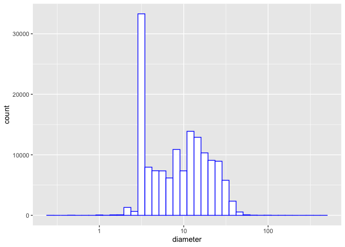<!-- -->

``` r
ggplot(vancouver_trees, aes(diameter)) + geom_histogram(binwidth = 5)
```

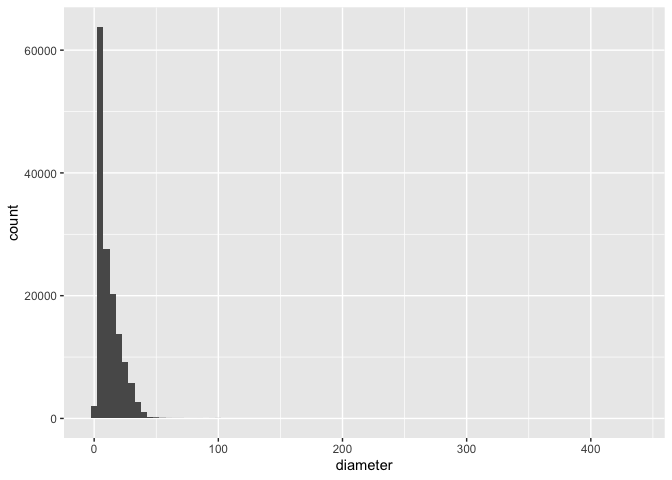<!-- -->

``` r
#I am using coord_cartesian function to show a zoomed in version of the plot since there are some outlier data points that do not allow you to view the distribution properly 
ggplot(vancouver_trees, aes(diameter)) + geom_histogram(binwidth = 5) + coord_cartesian(xlim = c(0, 100))
```

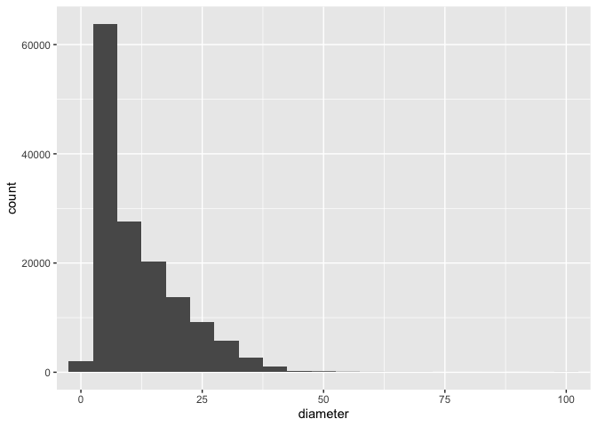<!-- -->

3.  Investigate how many missing values there are per variable. Can you
    find a way to plot this?

``` r
#Are there missing values in the variables I am interested in? 
any(is.na(vancouver_trees$diameter))
```

    ## [1] FALSE

``` r
any(is.na(vancouver_trees$curb))
```

    ## [1] FALSE

``` r
#as we can see there are no NA values in the variables I am interested in exploring. 

#To find missing values in other variables 
NA_values <- vancouver_trees %>% summarise(across(everything(), ~sum(is.na(.)))) 
print(NA_values)
```

    ## # A tibble: 1 × 20
    ##   tree_id civic_number std_str…¹ genus…² speci…³ culti…⁴ commo…⁵ assig…⁶ root_…⁷
    ##     <int>        <int>     <int>   <int>   <int>   <int>   <int>   <int>   <int>
    ## 1       0            0         0       0       0   67559       0       0       0
    ## # … with 11 more variables: plant_area <int>, on_street_block <int>,
    ## #   on_street <int>, neighbourhood_name <int>, street_side_name <int>,
    ## #   height_range_id <int>, diameter <int>, curb <int>, date_planted <int>,
    ## #   longitude <int>, latitude <int>, and abbreviated variable names
    ## #   ¹​std_street, ²​genus_name, ³​species_name, ⁴​cultivar_name, ⁵​common_name,
    ## #   ⁶​assigned, ⁷​root_barrier

``` r
#There are NA values in the following variables: cultivar_name, plant_area, date_planted, longitude and latitude. 

#Select the columns that have NA values and then plot them
Target_NA_values <- NA_values %>% select(cultivar_name, plant_area, date_planted, longitude, latitude)
print(Target_NA_values)
```

    ## # A tibble: 1 × 5
    ##   cultivar_name plant_area date_planted longitude latitude
    ##           <int>      <int>        <int>     <int>    <int>
    ## 1         67559       1486        76548     22771    22771

``` r
Target_NA_values %>% pivot_longer(cols=everything()) %>%
  ggplot(aes(x=name, y=value)) + geom_col() + xlab("Variable")+ ylab("Number of Missing Entries")
```

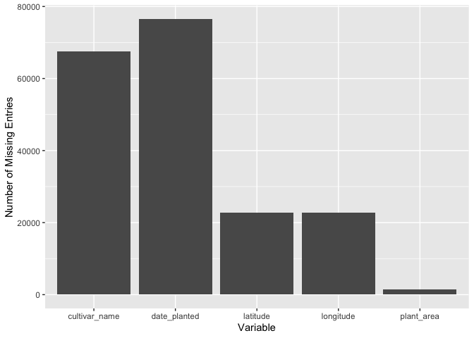<!-- -->

4.  Explore the relationship between 2 variables in a plot: count how
    many trees are planted near a curb versus ones that are not planted
    near a curb and then plot the diameter to show distribution of trees
    diameter with curb and without curb

``` r
count(vancouver_trees, curb)
```

    ## # A tibble: 2 × 2
    ##   curb       n
    ##   <chr>  <int>
    ## 1 N      12804
    ## 2 Y     133807

``` r
#133807 trees planted in the presence of a curb and 12804 trees with no curb presence.

ggplot(vancouver_trees, aes(curb, diameter)) + geom_jitter(alpha = 0.1) + scale_y_log10()
```

    ## Warning: Transformation introduced infinite values in continuous y-axis

    ## Warning: Removed 92 rows containing missing values (geom_point).

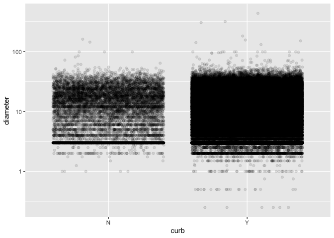<!-- -->

5.  Filter observations in your data according to your own criteria:
    Filtering the data with regards to presence or no presence of curb
    and filtering to give only the variable I am interested in,
    Diameter.

``` r
curb_yes <- filter(vancouver_trees, curb == "Y")
curb_no <- filter(vancouver_trees, curb == "N")

glimpse(curb_yes$diameter)
```

    ##  num [1:133807] 4 18 9 5 15 14 16 7.5 7.75 16 ...

``` r
glimpse(curb_no$diameter)
```

    ##  num [1:12804] 10 10 12 21 15 ...

## Task 3: Write Your Research Questions

1.  Does the presence of a curb negatively impact the diameter of the
    trees? i.e. Do trees have a smaller average diameter in the presence
    of a curb?
2.  Does the presence of a curb negatively impact the height range of
    the trees? i.e. Do trees have a smaller height range in the presence
    of a curb?
3.  Does genus have an affect on the diameter of the tree? i.e. is there
    a particular genera with larger tree diameter compared to other
    genera?
4.  Does having a root barrier negatively impact the diameter of the
    trees? i.e. Do trees have a smaller average diameter if there is a
    root barrier?

# Task 4: Process and summarize your data (13 points)

From Task 2, you should have an idea of the basic structure of your
dataset (e.g. number of rows and columns, class types, etc.). Here, we
will start investigating your data more in-depth using various data
manipulation functions.

### 1.1 (10 points)

Now, for each of your four research questions, choose one task from
options 1-4 (summarizing), and one other task from 4-8 (graphing). You
should have 2 tasks done for each research question (8 total). Make sure
it makes sense to do them! (e.g. don’t use a numerical variables for a
task that needs a categorical variable.). Comment on why each task helps
(or doesn’t!) answer the corresponding research question.

Ensure that the output of each operation is printed!

**Summarizing:**

1.  Compute the *range*, *mean*, and *two other summary statistics* of
    **one numerical variable** across the groups of **one categorical
    variable** from your data.
2.  Compute the number of observations for at least one of your
    categorical variables. Do not use the function `table()`!
3.  Create a categorical variable with 3 or more groups from an existing
    numerical variable. You can use this new variable in the other
    tasks! *An example: age in years into “child, teen, adult, senior”.*
4.  Based on two categorical variables, calculate two summary statistics
    of your choosing.

**Graphing:**

5.  Create a graph out of summarized variables that has at least two
    geom layers.
6.  Create a graph of your choosing, make one of the axes logarithmic,
    and format the axes labels so that they are “pretty” or easier to
    read.
7.  Make a graph where it makes sense to customize the alpha
    transparency.
8.  Create 3 histograms out of summarized variables, with each histogram
    having different sized bins. Pick the “best” one and explain why it
    is the best.

Make sure it’s clear what research question you are doing each operation
for!

<!------------------------- Start your work below ----------------------------->

**Question 1: Does the presence of a curb negatively impact the diameter
of the trees? i.e. Do trees have a smaller average diameter in the
presence of a curb?**

Summarizing Task 1

``` r
#finding range of diameters for trees with curb 
range_diameters <-range(curb_yes$diameter)
print(range_diameters)
```

    ## [1]   0 435

``` r
#finding mean of diameters for trees with curb 
mean_diameters <- mean(curb_yes$diameter)
print(mean_diameters)
```

    ## [1] 11.3862

``` r
#finding standard deviation of diameters for trees with curb
stddeviation_diameters <- sd(curb_yes$diameter)
print(stddeviation_diameters)
```

    ## [1] 9.089389

``` r
#finding median diameter of trees with curb
median_diameter <- median(curb_yes$diameter)
print(median_diameter)
```

    ## [1] 9

``` r
#OR we can use the summary function to find out min, max, mean, median, 1st quartile and second quartile 
summary(curb_yes$diameter)
```

    ##    Min. 1st Qu.  Median    Mean 3rd Qu.    Max. 
    ##    0.00    3.75    9.00   11.39   16.00  435.00

``` r
summary(curb_no$diameter)
```

    ##    Min. 1st Qu.  Median    Mean 3rd Qu.    Max. 
    ##    0.00    3.00   10.00   12.58   19.00  161.00

``` r
#from this summarizing exercise, we can see that there is a higher mean and median diameter of trees not near a curb compared to trees near a curb.
```

Graphing Task 8

``` r
ggplot(curb_yes, aes(diameter)) + geom_histogram(bins = 15)
```

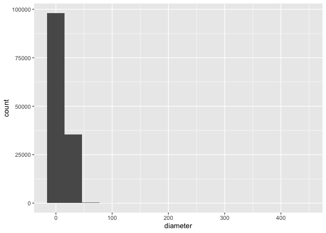<!-- -->

``` r
ggplot(curb_yes, aes(diameter)) + geom_histogram(bins = 25)
```

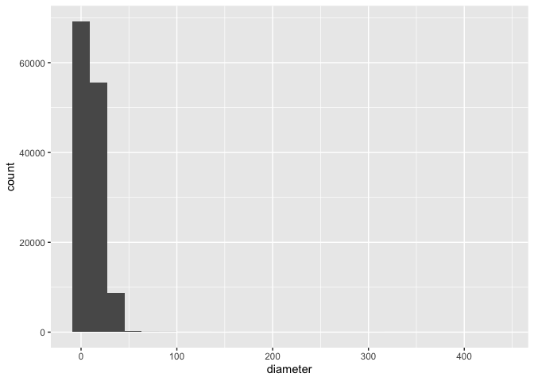<!-- -->

``` r
ggplot(curb_yes, aes(diameter)) + geom_histogram(bins = 40)
```

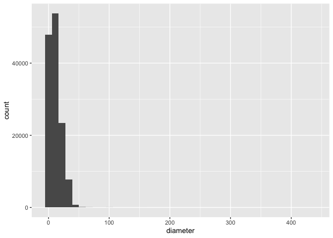<!-- -->

``` r
#Here I have plotted the diameter of trees planted near a curb using different sized bins. We can see that a larger bin size of around 40 enables us to see the pattern of the data better. 
```

**Question 2: Does the presence of a curb negatively impact the height
range of the trees? i.e. Do trees have a smaller height range in the
presence of a curb?**

Summarizing Task 2

``` r
#Compute number of observations for all the height ranges (0= 0-10 ft, 1= 1-10 ft, 2= 20-30 ft, 3= 3-40 ft and so on till 10= 100+ ft) for the curb_yes subset and the curb_no subset 
curb_yes$height_range_id <- as.factor(curb_yes$height_range_id)
summary(curb_yes$height_range_id)
```

    ##     0     1     2     3     4     5     6     7     8     9    10 
    ##   173 35860 39584 24441 18683  7834  4527  1853   659   182    11

``` r
curb_no$height_range_id <- as.factor(curb_no$height_range_id)
summary(curb_no$height_range_id)
```

    ##    0    1    2    3    4    5    6    7    8    9   10 
    ##   41 4099 2622 1866 1847 1180  668  372   87   21    1

``` r
#From this summarizing exercise we can see that as we get to the higher height ranges (70-100+ ft) the number of observations become less in the curb_no than in the curb_yes. Showing us that there are fewer taller trees where there is no curb present compared to where the curb is present. This could be just due to the fact that there are fewer trees in general in the curb_no subset. Which we can see clearly in Task 2, exercise 4.  
```

Graphing Task 5

``` r
ggplot(vancouver_trees, aes(curb, height_range_id)) + geom_boxplot() + geom_count()
```

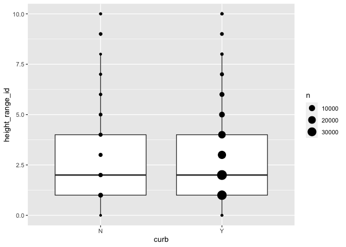<!-- -->

``` r
#Through plotting the data on a boxplot, you can actually see that there is not much different in height range between curb and no curb subsets. Through adding the geom_count() layer you can also see that there are some outliers in the dataset. 
```

**Question 3: Does genus affect the diameter of the tree? i.e. is there
a particular genus with larger tree diameter?**

Summarizing Task 1

``` r
#After trying to complete this task for all genus, I realized that there are too many and it would make sense to select only a few genera and complete the analysis on that. So first I will filter the dataset to narrow it down to only 5 randomly selected genera. 

vancouver_trees_genus <- vancouver_trees %>% filter(genus_name %in% c("NYSSA", "FAGUS", "ACER", "POPULUS", "MAGNOLIA"))
vancouver_trees_genus
```

    ## # A tibble: 45,585 × 20
    ##    tree_id civic_number std_st…¹ genus…² speci…³ culti…⁴ commo…⁵ assig…⁶ root_…⁷
    ##      <dbl>        <dbl> <chr>    <chr>   <chr>   <chr>   <chr>   <chr>   <chr>  
    ##  1  149604         5032 WINDSOR… ACER    CAMPES… <NA>    HEDGE … N       N      
    ##  2  149617         4909 SHERBRO… ACER    PLATAN… COLUMN… COLUMN… N       N      
    ##  3  149618         4925 SHERBRO… ACER    PLATAN… COLUMN… COLUMN… N       N      
    ##  4  149619         4969 SHERBRO… ACER    PLATAN… COLUMN… COLUMN… N       N      
    ##  5  149640         6968 SELKIRK… ACER    PLATAN… COLUMN… COLUMN… N       N      
    ##  6  149680         5311 WINDSOR… ACER    CAMPES… <NA>    HEDGE … N       N      
    ##  7  149683         7011 SELKIRK… ACER    PLATAN… COLUMN… COLUMN… N       N      
    ##  8  149684         1223 W 54TH … ACER    PLATAN… COLUMN… COLUMN… N       N      
    ##  9  149686         5007 WINDSOR… ACER    CAMPES… <NA>    HEDGE … N       N      
    ## 10  149694         1292 W 49TH … ACER    PLATAN… COLUMN… COLUMN… N       N      
    ## # … with 45,575 more rows, 11 more variables: plant_area <chr>,
    ## #   on_street_block <dbl>, on_street <chr>, neighbourhood_name <chr>,
    ## #   street_side_name <chr>, height_range_id <dbl>, diameter <dbl>, curb <chr>,
    ## #   date_planted <date>, longitude <dbl>, latitude <dbl>, and abbreviated
    ## #   variable names ¹​std_street, ²​genus_name, ³​species_name, ⁴​cultivar_name,
    ## #   ⁵​common_name, ⁶​assigned, ⁷​root_barrier

``` r
#Finding the mean, range, standard deviation and median diameters for each of the genus selected. 
vancouver_trees_summary <- vancouver_trees_genus %>% select(genus_name, diameter) %>% group_by(genus_name) %>% 
  summarize(diam_mean = mean(diameter), range_diam = range(diameter), diam_sd = sd(diameter), diam_median = median(diameter))
```

    ## `summarise()` has grouped output by 'genus_name'. You can override using the
    ## `.groups` argument.

``` r
#We can see that there are two columns for each genera as there is a min and max given for the range. 
```

Graphing Task 6

``` r
vancouver_trees_genus %>% select(genus_name, diameter) %>%
  filter(genus_name == "MAGNOLIA") %>% ggplot(aes(diameter)) + geom_histogram(binwidth = 3, color = "white") + scale_y_log10() +xlab("Log of Diameter") + ggtitle("Distribution of Log of Diameters of Magnolia Trees")
```

    ## Warning: Transformation introduced infinite values in continuous y-axis

    ## Warning: Removed 1 rows containing missing values (geom_bar).

<!-- -->

``` r
vancouver_trees_genus %>% select(genus_name, diameter) %>%
  filter(genus_name == "FAGUS") %>% ggplot(aes(diameter)) + geom_histogram(binwidth = 3, color = "white") + scale_y_log10() +xlab("Log of Diameter") + ggtitle("Distribution of Log of Diameters of Fagus Trees")
```

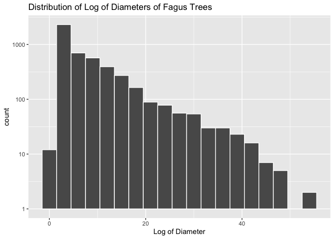<!-- -->

**Question 4: Does having a root barrier negatively impact the diameter
of the trees? i.e. Do trees have a smaller average diameter if there is
a root barrier?**

Summarizing Task 1

``` r
rootbarrier_yes <- filter(vancouver_trees, root_barrier == "Y")
rootbarrier_no <- filter(vancouver_trees, root_barrier == "N")

#finding range of diameters for trees with root barrier
range_diameters_rootbarrier <-range(rootbarrier_yes$diameter)
print(range_diameters_rootbarrier)
```

    ## [1]  0.5 86.0

``` r
#finding mean of diameters for trees with root barrier
mean_diameters_rootbarrier <- mean(rootbarrier_yes$diameter)
print(mean_diameters_rootbarrier)
```

    ## [1] 4.40038

``` r
#finding standard deviation of diameters for trees with root barrier
stddeviation_diameters_rootbarrier <- sd(rootbarrier_yes$diameter)
print(stddeviation_diameters_rootbarrier)
```

    ## [1] 2.998134

``` r
#finding median diameter of trees with root barrier
median_diameter_rootbarrier <- median(rootbarrier_yes$diameter)
print(median_diameter_rootbarrier)
```

    ## [1] 3

``` r
#OR we can use the summary function to find out min, max, mean, median, 1st quartile and second quartile of both groups (trees with and without root barrier)
summary(rootbarrier_yes$diameter)
```

    ##    Min. 1st Qu.  Median    Mean 3rd Qu.    Max. 
    ##     0.5     3.0     3.0     4.4     5.0    86.0

``` r
summary(rootbarrier_no$diameter)
```

    ##    Min. 1st Qu.  Median    Mean 3rd Qu.    Max. 
    ##    0.00    4.00   10.00   11.96   17.00  435.00

``` r
#From this summarizing exercise, we have found that trees without root barriers have a larger average diameter compared to trees with root barriers. Additionally, the maximum diameter of trees without root barriers is much higher than the maximum diameter of trees with root barriers.
```

Graphing Task 6

``` r
ggplot(vancouver_trees, aes(x = root_barrier, y = diameter, color=root_barrier)) + xlab("Root Barrier") + ylab("log of Diameter") + geom_point(alpha = 0.5) + scale_y_continuous(trans='log10') + scale_fill_discrete(name = "Root Barrier") + ggtitle("Log of Diameter by Root Barrier")
```

    ## Warning: Transformation introduced infinite values in continuous y-axis

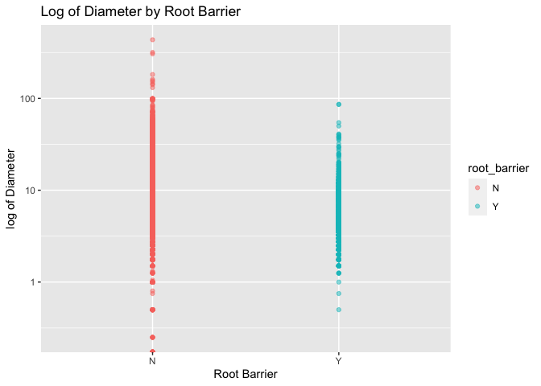<!-- -->

<!----------------------------------------------------------------------------->

### 1.2 (3 points)

Based on the operations that you’ve completed, how much closer are you
to answering your research questions? Think about what aspects of your
research questions remain unclear. Can your research questions be
refined, now that you’ve investigated your data a bit more? Which
research questions are yielding interesting results?

<!-------------------------- Start your work below ---------------------------->

Through this exploration, I have got a good understanding of the dataset
and the observations. First, I looked at whether presence of curb and
root barrier affects the diameter of the tree and through my analysis I
am closer to answering this question. I was able to note a higher mean
and median diameter of trees that were planted not in presence of a curb
compared to trees that had a curb. In addition to this, I also noted
that trees with no root barrier have a higher mean and median diameter
and a larger maximum diameter value compared to trees with root
barriers. So we can see that both presence of curb and root barrier have
an affect on the diameter.

Secondly, I selected 5 random genera and looked at whether genera has an
effect on diameter. From my sample, I could tell that the Populus tree
has the largest average diameter whereas the Nyssa trees has the
smallest average diameter. I believe that more analysis can go into this
question.

Further exploration could be done with regards to particular species.
After this analysis, I might want to refine my research question by only
looking at one genera or species and the different cultivar varieties it
has. Question 3 and 4 seem the most interesting if I narrow it down. I
would like to explore the correlation, if any - to do this I try
computing a logistic regression.  
<!----------------------------------------------------------------------------->

### Attribution

Thanks to Icíar Fernández Boyano for mostly putting this together, and
Vincenzo Coia for launching.
