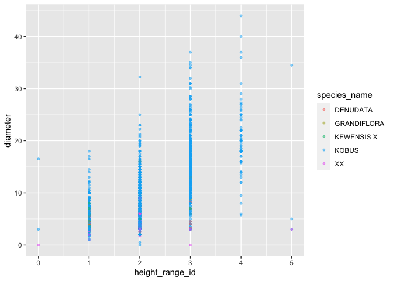
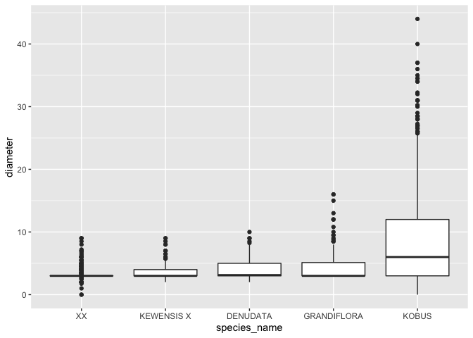
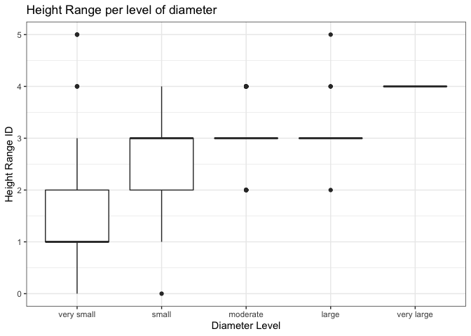

Mini Data Analysis Milestone 2
================

*To complete this milestone, you can edit [this `.rmd`
file](https://raw.githubusercontent.com/UBC-STAT/stat545.stat.ubc.ca/master/content/mini-project/mini-project-2.Rmd)
directly. Fill in the sections that are commented out with
`<!--- start your work here--->`. When you are done, make sure to knit
to an `.md` file by changing the output in the YAML header to
`github_document`, before submitting a tagged release on canvas.*

# Welcome to your second (and last) milestone in your mini data analysis project!

In Milestone 1, you explored your data, came up with research questions,
and obtained some results by making summary tables and graphs. This
time, we will first explore more in depth the concept of *tidy data.*
Then, you’ll be sharpening some of the results you obtained from your
previous milestone by:

- Manipulating special data types in R: factors and/or dates and times.
- Fitting a model object to your data, and extract a result.
- Reading and writing data as separate files.

**NOTE**: The main purpose of the mini data analysis is to integrate
what you learn in class in an analysis. Although each milestone provides
a framework for you to conduct your analysis, it’s possible that you
might find the instructions too rigid for your data set. If this is the
case, you may deviate from the instructions – just make sure you’re
demonstrating a wide range of tools and techniques taught in this class.

# Instructions

**To complete this milestone**, edit [this very `.Rmd`
file](https://raw.githubusercontent.com/UBC-STAT/stat545.stat.ubc.ca/master/content/mini-project/mini-project-2.Rmd)
directly. Fill in the sections that are tagged with
`<!--- start your work here--->`.

**To submit this milestone**, make sure to knit this `.Rmd` file to an
`.md` file by changing the YAML output settings from
`output: html_document` to `output: github_document`. Commit and push
all of your work to your mini-analysis GitHub repository, and tag a
release on GitHub. Then, submit a link to your tagged release on canvas.

**Points**: This milestone is worth 55 points (compared to the 45 points
of the Milestone 1): 45 for your analysis, and 10 for your entire
mini-analysis GitHub repository. Details follow.

**Research Questions**: In Milestone 1, you chose two research questions
to focus on. Wherever realistic, your work in this milestone should
relate to these research questions whenever we ask for justification
behind your work. In the case that some tasks in this milestone don’t
align well with one of your research questions, feel free to discuss
your results in the context of a different research question.

# Learning Objectives

By the end of this milestone, you should:

- Understand what *tidy* data is, and how to create it using `tidyr`.
- Generate a reproducible and clear report using R Markdown.
- Manipulating special data types in R: factors and/or dates and times.
- Fitting a model object to your data, and extract a result.
- Reading and writing data as separate files.

# Setup

Begin by loading your data and the tidyverse package below:

``` r
library(datateachr) # <- might contain the data you picked!
library(tidyverse)
```

# Task 1: Tidy your data (15 points)

In this task, we will do several exercises to reshape our data. The goal
here is to understand how to do this reshaping with the `tidyr` package.

A reminder of the definition of *tidy* data:

- Each row is an **observation**
- Each column is a **variable**
- Each cell is a **value**

*Tidy’ing* data is sometimes necessary because it can simplify
computation. Other times it can be nice to organize data so that it can
be easier to understand when read manually.

### 2.1 (2.5 points)

Based on the definition above, can you identify if your data is tidy or
untidy? Go through all your columns, or if you have \>8 variables, just
pick 8, and explain whether the data is untidy or tidy.

<!--------------------------- Start your work below --------------------------->

## Identifying Data

``` r
glimpse(vancouver_trees)
```

    ## Rows: 146,611
    ## Columns: 20
    ## $ tree_id            <dbl> 149556, 149563, 149579, 149590, 149604, 149616, 149…
    ## $ civic_number       <dbl> 494, 450, 4994, 858, 5032, 585, 4909, 4925, 4969, 7…
    ## $ std_street         <chr> "W 58TH AV", "W 58TH AV", "WINDSOR ST", "E 39TH AV"…
    ## $ genus_name         <chr> "ULMUS", "ZELKOVA", "STYRAX", "FRAXINUS", "ACER", "…
    ## $ species_name       <chr> "AMERICANA", "SERRATA", "JAPONICA", "AMERICANA", "C…
    ## $ cultivar_name      <chr> "BRANDON", NA, NA, "AUTUMN APPLAUSE", NA, "CHANTICL…
    ## $ common_name        <chr> "BRANDON ELM", "JAPANESE ZELKOVA", "JAPANESE SNOWBE…
    ## $ assigned           <chr> "N", "N", "N", "Y", "N", "N", "N", "N", "N", "N", "…
    ## $ root_barrier       <chr> "N", "N", "N", "N", "N", "N", "N", "N", "N", "N", "…
    ## $ plant_area         <chr> "N", "N", "4", "4", "4", "B", "6", "6", "3", "3", "…
    ## $ on_street_block    <dbl> 400, 400, 4900, 800, 5000, 500, 4900, 4900, 4900, 7…
    ## $ on_street          <chr> "W 58TH AV", "W 58TH AV", "WINDSOR ST", "E 39TH AV"…
    ## $ neighbourhood_name <chr> "MARPOLE", "MARPOLE", "KENSINGTON-CEDAR COTTAGE", "…
    ## $ street_side_name   <chr> "EVEN", "EVEN", "EVEN", "EVEN", "EVEN", "ODD", "ODD…
    ## $ height_range_id    <dbl> 2, 4, 3, 4, 2, 2, 3, 3, 2, 2, 2, 5, 3, 2, 2, 2, 2, …
    ## $ diameter           <dbl> 10.00, 10.00, 4.00, 18.00, 9.00, 5.00, 15.00, 14.00…
    ## $ curb               <chr> "N", "N", "Y", "Y", "Y", "Y", "Y", "Y", "Y", "Y", "…
    ## $ date_planted       <date> 1999-01-13, 1996-05-31, 1993-11-22, 1996-04-29, 19…
    ## $ longitude          <dbl> -123.1161, -123.1147, -123.0846, -123.0870, -123.08…
    ## $ latitude           <dbl> 49.21776, 49.21776, 49.23938, 49.23469, 49.23894, 4…

The 8 variables that I have picked are “tree_id”, “genus_name”,
“species_name”, “root_barrier”, “neighbourhood_name”, “height_range_id”,
“diameter” and “curb”. Looking at these columns, we can see that the
data is tidy. This is because each column is one variable, each row is
one observation and each cell has only one value. I chose these
variables as all of them relate to the research questions I explored in
milestone 1. The questions were whether or not curb and root barrier
affected the height and diameter of the trees. I also explored specific
genera and species hence these columns are important to include. From
the variables I have chosen, I can see that the data is tidy. However,
overall the dataset might be considered untidy due to some repetitive
columns, but those are not relevant to my research questions. Hence I
will be untidying the data and tidying it back to its original state.

<!----------------------------------------------------------------------------->

### 2.2 (5 points)

Now, if your data is tidy, untidy it! Then, tidy it back to it’s
original state.

If your data is untidy, then tidy it! Then, untidy it back to it’s
original state.

Be sure to explain your reasoning for this task. Show us the “before”
and “after”.

<!--------------------------- Start your work below --------------------------->

## Tidy Data - data can be seen above

## Untidying Data

``` r
#Using pivot_wider() to make the dataset untidy- we can do this with genus and/or species column. This will introduce many NA values to certain cells. 
untidy_dataset <- vancouver_trees %>%
  pivot_wider(names_from = genus_name,
              values_from = diameter)

#Combining "civic_number" and "std_street" to create a full associated tree address. Since this column contains 2 values of different variables, it is considered untidy
untidy_dataset <- untidy_dataset %>% unite(full_associated_address, c("civic_number", "std_street"), sep = ",")

#combining latitude and longitude to have a cell with more than one value, making it untidy 
untidy_dataset <- untidy_dataset %>% unite(coordinates, c("longitude", "latitude"), sep = ",")


#AFTER UNTIDYING
head(untidy_dataset)
```

    ## # A tibble: 6 × 113
    ##   tree_id full_associa…¹ speci…² culti…³ commo…⁴ assig…⁵ root_…⁶ plant…⁷ on_st…⁸
    ##     <dbl> <chr>          <chr>   <chr>   <chr>   <chr>   <chr>   <chr>     <dbl>
    ## 1  149556 494,W 58TH AV  AMERIC… BRANDON BRANDO… N       N       N           400
    ## 2  149563 450,W 58TH AV  SERRATA <NA>    JAPANE… N       N       N           400
    ## 3  149579 4994,WINDSOR … JAPONI… <NA>    JAPANE… N       N       4          4900
    ## 4  149590 858,E 39TH AV  AMERIC… AUTUMN… AUTUMN… Y       N       4           800
    ## 5  149604 5032,WINDSOR … CAMPES… <NA>    HEDGE … N       N       4          5000
    ## 6  149616 585,W 61ST AV  CALLER… CHANTI… CHANTI… N       N       B           500
    ## # … with 104 more variables: on_street <chr>, neighbourhood_name <chr>,
    ## #   street_side_name <chr>, height_range_id <dbl>, curb <chr>,
    ## #   date_planted <date>, coordinates <chr>, ULMUS <dbl>, ZELKOVA <dbl>,
    ## #   STYRAX <dbl>, FRAXINUS <dbl>, ACER <dbl>, PYRUS <dbl>, TILIA <dbl>,
    ## #   HIBISCUS <dbl>, LIQUIDAMBAR <dbl>, PRUNUS <dbl>, CARPINUS <dbl>,
    ## #   QUERCUS <dbl>, CRATAEGUS <dbl>, ROBINIA <dbl>, PARROTIA <dbl>,
    ## #   CORNUS <dbl>, MAGNOLIA <dbl>, CATALPA <dbl>, FAGUS <dbl>, …

The Data above is now untidy as there are NA values in many cells, some
cells have more than one value and the each row is not necessarily an
observation.

## Tidying Data

``` r
#Here I will be r-tidying the data. First, we use pivot_longer() to return genus_name to observations and not individual columns so that we do not have NA values 
tidy_dataset <- untidy_dataset %>%
  pivot_longer(cols = c(ULMUS:ALBIZIA),
               names_to = "genus_name",
               values_to = "diameter",
               values_drop_na = TRUE)

#I will separate the full_associated_address into "civic_number" and "std_street" 
tidy_dataset <- tidy_dataset %>% separate(col = full_associated_address, into = c("civic_number", "std_street"), sep = ",")

#I will separate the longitude and latitude 
tidy_dataset <- tidy_dataset %>% separate(col = coordinates, into = c("longitude", "latitude"), sep = ",")

#AFTER TIDYING 
head(tidy_dataset)
```

    ## # A tibble: 6 × 20
    ##   tree_id civic_number std_str…¹ speci…² culti…³ commo…⁴ assig…⁵ root_…⁶ plant…⁷
    ##     <dbl> <chr>        <chr>     <chr>   <chr>   <chr>   <chr>   <chr>   <chr>  
    ## 1  149556 494          W 58TH AV AMERIC… BRANDON BRANDO… N       N       N      
    ## 2  149563 450          W 58TH AV SERRATA <NA>    JAPANE… N       N       N      
    ## 3  149579 4994         WINDSOR … JAPONI… <NA>    JAPANE… N       N       4      
    ## 4  149590 858          E 39TH AV AMERIC… AUTUMN… AUTUMN… Y       N       4      
    ## 5  149604 5032         WINDSOR … CAMPES… <NA>    HEDGE … N       N       4      
    ## 6  149616 585          W 61ST AV CALLER… CHANTI… CHANTI… N       N       B      
    ## # … with 11 more variables: on_street_block <dbl>, on_street <chr>,
    ## #   neighbourhood_name <chr>, street_side_name <chr>, height_range_id <dbl>,
    ## #   curb <chr>, date_planted <date>, longitude <chr>, latitude <chr>,
    ## #   genus_name <chr>, diameter <dbl>, and abbreviated variable names
    ## #   ¹​std_street, ²​species_name, ³​cultivar_name, ⁴​common_name, ⁵​assigned,
    ## #   ⁶​root_barrier, ⁷​plant_area

<!----------------------------------------------------------------------------->

### 2.3 (7.5 points)

Now, you should be more familiar with your data, and also have made
progress in answering your research questions. Based on your interest,
and your analyses, pick 2 of the 4 research questions to continue your
analysis in the next four tasks:

<!-------------------------- Start your work below ---------------------------->

1.  *Is there a correlation between height and diameter for the species
    in the Magnolia Genera?*
2.  *Does having a root barrier affect the diameter of the Magnolia
    Trees?*

<!----------------------------------------------------------------------------->

Explain your decision for choosing the above two research questions.

<!--------------------------- Start your work below --------------------------->

At the end of Milestone 1, I was interested to see if there was a
correlation between height and diameter for the tree species,focusing on
one particular genera as the dataset is quite large. If we find there is
a correlation, one could answer other questions such as which species
has the largest height and diameter and where the highest population of
this species is (neighborhood wise). Subsequently, I would also like to
see if having a root barrier affects the diameter of the particular
genera of tree chosen. When conducting preliminary analysis in Milestone
1, we saw that there is some impact of root barrier on the diameters of
trees so further investigations would be helpful.
<!----------------------------------------------------------------------------->

Now, try to choose a version of your data that you think will be
appropriate to answer these 2 questions. Use between 4 and 8 functions
that we’ve covered so far (i.e. by filtering, cleaning, tidy’ing,
dropping irrelevant columns, etc.).

<!--------------------------- Start your work below --------------------------->

``` r
#Select only the Magnolia Genera 
vancouver_trees_subset <- vancouver_trees %>% filter(genus_name == "MAGNOLIA") 

#Group by species and count how many trees of each species has been planted 
vancouver_trees_count <- vancouver_trees_subset %>% group_by(species_name) %>%
  summarize(count= n()) %>% arrange((count))
vancouver_trees_count
```

    ## # A tibble: 20 × 2
    ##    species_name   count
    ##    <chr>          <int>
    ##  1 SPRENGERI          1
    ##  2 VEITCHII   X       1
    ##  3 CYLINDRICA         2
    ##  4 ZENII              2
    ##  5 STELLATA           4
    ##  6 SARGENTIANA        5
    ##  7 ACUMINATA          7
    ##  8 DAWSONIANA         7
    ##  9 OFFICINALIS        8
    ## 10 VIRGINIANA        10
    ## 11 SOULANGEANA  X    16
    ## 12 LILIIFLORA        18
    ## 13 LOEBNERI  X       18
    ## 14 SIEBOLDII         29
    ## 15 SPECIES           56
    ## 16 GRANDIFLORA       92
    ## 17 DENUDATA          94
    ## 18 KEWENSIS X       113
    ## 19 XX               725
    ## 20 KOBUS           2691

``` r
#We can see the the 5 species with the highest count are Kobus, XX, Kewensis X, Denudata and Grandiflora. We will be focusing on these 5 species. 
vancouver_trees_subset <- vancouver_trees_subset %>% filter(species_name %in% c("KOBUS", "XX", "KEWENSIS X", "DENUDATA", "GRANDIFLORA"))

#Selecting only the required columns 
vancouver_trees_subset <- vancouver_trees_subset %>% subset(select = c("tree_id", "species_name", "root_barrier", "neighbourhood_name", "height_range_id", "diameter", "date_planted"))

glimpse(vancouver_trees_subset)
```

    ## Rows: 3,715
    ## Columns: 7
    ## $ tree_id            <dbl> 155436, 155990, 158165, 158768, 158769, 159432, 159…
    ## $ species_name       <chr> "KOBUS", "KOBUS", "XX", "KOBUS", "KOBUS", "KOBUS", …
    ## $ root_barrier       <chr> "N", "N", "N", "N", "N", "N", "N", "N", "N", "N", "…
    ## $ neighbourhood_name <chr> "WEST POINT GREY", "RENFREW-COLLINGWOOD", "OAKRIDGE…
    ## $ height_range_id    <dbl> 2, 2, 1, 2, 2, 3, 3, 1, 1, 2, 1, 1, 1, 2, 1, 1, 1, …
    ## $ diameter           <dbl> 6.00, 7.75, 3.00, 3.00, 3.00, 12.00, 14.00, 3.00, 3…
    ## $ date_planted       <date> 1997-01-23, 1997-12-10, NA, 1996-11-25, 1996-11-25…

``` r
#I will be using this subset to try and answer both my research questions
```

<!----------------------------------------------------------------------------->

# Task 2: Special Data Types (10)

For this exercise, you’ll be choosing two of the three tasks below –
both tasks that you choose are worth 5 points each.

But first, tasks 1 and 2 below ask you to modify a plot you made in a
previous milestone. The plot you choose should involve plotting across
at least three groups (whether by facetting, or using an aesthetic like
colour). Place this plot below (you’re allowed to modify the plot if
you’d like). If you don’t have such a plot, you’ll need to make one.
Place the code for your plot below.

<!-------------------------- Start your work below ---------------------------->

``` r
#Plot from Milestone 1 but changed slightly to use the subset created in this milestone. The basic plot will be height_range_id against diameter plotted across the 5 species. 
ggplot(vancouver_trees_subset, aes(x = height_range_id, y = diameter)) + geom_point(aes(color = species_name), size = 1, alpha = 0.5)
```

<!-- -->

<!----------------------------------------------------------------------------->

Now, choose two of the following tasks.

1.  Produce a new plot that reorders a factor in your original plot,
    using the `forcats` package (3 points). Then, in a sentence or two,
    briefly explain why you chose this ordering (1 point here for
    demonstrating understanding of the reordering, and 1 point for
    demonstrating some justification for the reordering, which could be
    subtle or speculative.)

2.  Produce a new plot that groups some factor levels together into an
    “other” category (or something similar), using the `forcats` package
    (3 points). Then, in a sentence or two, briefly explain why you
    chose this grouping (1 point here for demonstrating understanding of
    the grouping, and 1 point for demonstrating some justification for
    the grouping, which could be subtle or speculative.)

3.  If your data has some sort of time-based column like a date (but
    something more granular than just a year):

    1.  Make a new column that uses a function from the `lubridate` or
        `tsibble` package to modify your original time-based column. (3
        points)

        - Note that you might first have to *make* a time-based column
          using a function like `ymd()`, but this doesn’t count.
        - Examples of something you might do here: extract the day of
          the year from a date, or extract the weekday, or let 24 hours
          elapse on your dates.

    2.  Then, in a sentence or two, explain how your new column might be
        useful in exploring a research question. (1 point for
        demonstrating understanding of the function you used, and 1
        point for your justification, which could be subtle or
        speculative).

        - For example, you could say something like “Investigating the
          day of the week might be insightful because penguins don’t
          work on weekends, and so may respond differently”.

<!-------------------------- Start your work below ---------------------------->

**Task Number**: 1

``` r
vancouver_trees_species <- vancouver_trees_subset %>%
   mutate(species_name = fct_reorder(species_name, diameter, mean))
head(vancouver_trees_species)
```

    ## # A tibble: 6 × 7
    ##   tree_id species_name root_barrier neighbourhood_n…¹ heigh…² diame…³ date_pla…⁴
    ##     <dbl> <fct>        <chr>        <chr>               <dbl>   <dbl> <date>    
    ## 1  155436 KOBUS        N            WEST POINT GREY         2    6    1997-01-23
    ## 2  155990 KOBUS        N            RENFREW-COLLINGW…       2    7.75 1997-12-10
    ## 3  158165 XX           N            OAKRIDGE                1    3    NA        
    ## 4  158768 KOBUS        N            VICTORIA-FRASERV…       2    3    1996-11-25
    ## 5  158769 KOBUS        N            VICTORIA-FRASERV…       2    3    1996-11-25
    ## 6  159432 KOBUS        N            KERRISDALE              3   12    NA        
    ## # … with abbreviated variable names ¹​neighbourhood_name, ²​height_range_id,
    ## #   ³​diameter, ⁴​date_planted

``` r
ggplot(vancouver_trees_species, aes(species_name, diameter)) + geom_boxplot()
```

<!-- -->

Using fct_reorder(), I created a plot with the levels of the species
column in increasing order of diameter. Normally, the data gets arranged
in alphabetical order however I wanted to the species that has the
highest mean diameter, hence the function was used to see which species
of the Magnolia Genera has the highest diameter. In this case, it is the
Kobus species.

<!----------------------------------------------------------------------------->
<!-------------------------- Start your work below ---------------------------->

**Task Number**: 2

``` r
#Grouping diameter into another category 
vancouver_trees_2 <- vancouver_trees_subset %>% 
  mutate(diameter_level = factor(case_when(diameter < 10 ~ "very small",
                                    diameter < 20 ~ "small",
                                    diameter < 30 ~ "moderate",
                                    diameter < 40 ~ "large",
                                    TRUE ~ "very large"), levels = c("very small", "small", "moderate", "large", "very large")))
head(vancouver_trees_2)
```

    ## # A tibble: 6 × 8
    ##   tree_id species_name root_barrier neighbo…¹ heigh…² diame…³ date_pla…⁴ diame…⁵
    ##     <dbl> <chr>        <chr>        <chr>       <dbl>   <dbl> <date>     <fct>  
    ## 1  155436 KOBUS        N            WEST POI…       2    6    1997-01-23 very s…
    ## 2  155990 KOBUS        N            RENFREW-…       2    7.75 1997-12-10 very s…
    ## 3  158165 XX           N            OAKRIDGE        1    3    NA         very s…
    ## 4  158768 KOBUS        N            VICTORIA…       2    3    1996-11-25 very s…
    ## 5  158769 KOBUS        N            VICTORIA…       2    3    1996-11-25 very s…
    ## 6  159432 KOBUS        N            KERRISDA…       3   12    NA         small  
    ## # … with abbreviated variable names ¹​neighbourhood_name, ²​height_range_id,
    ## #   ³​diameter, ⁴​date_planted, ⁵​diameter_level

``` r
ggplot(vancouver_trees_2) + geom_boxplot(aes(x = diameter_level, y = height_range_id)) +
  labs(y = "Height Range ID", x= "Diameter Level") +
  scale_x_discrete(drop = FALSE) + ggtitle("Height Range per level of diameter") +
  theme_bw()
```

<!-- -->

Here I have categorized diameter into other categories “very small”,
“small”, “moderate” etc. This is to understand the range of the diameter
within the Magnolia Genera and understand it’s association with height.
Through this plot, we can see that the mean height range ID of trees in
the very small diameter category is smaller than the mean height range
ID of trees in the small diameter category. Indicating to us that trees
with small diameter also have smaller heights for this genera.

<!----------------------------------------------------------------------------->

# Task 3: Modelling

## 2.0 (no points)

Pick a research question, and pick a variable of interest (we’ll call it
“Y”) that’s relevant to the research question. Indicate these.

<!-------------------------- Start your work below ---------------------------->

**Research Question**: Is there an association between height and
diameter for the selected species of the Magnolia Genera?

**Variable of interest**: Diameter

<!----------------------------------------------------------------------------->

## 2.1 (5 points)

Fit a model or run a hypothesis test that provides insight on this
variable with respect to the research question. Store the model object
as a variable, and print its output to screen. We’ll omit having to
justify your choice, because we don’t expect you to know about model
specifics in STAT 545.

- **Note**: It’s OK if you don’t know how these models/tests work. Here
  are some examples of things you can do here, but the sky’s the limit.

  - You could fit a model that makes predictions on Y using another
    variable, by using the `lm()` function.
  - You could test whether the mean of Y equals 0 using `t.test()`, or
    maybe the mean across two groups are different using `t.test()`, or
    maybe the mean across multiple groups are different using `anova()`
    (you may have to pivot your data for the latter two).
  - You could use `lm()` to test for significance of regression.

<!-------------------------- Start your work below ---------------------------->

``` r
my_lm <- lm(diameter ~ height_range_id, data = vancouver_trees_subset)
summary(my_lm)
```

    ## 
    ## Call:
    ## lm(formula = diameter ~ height_range_id, data = vancouver_trees_subset)
    ## 
    ## Residuals:
    ##      Min       1Q   Median       3Q      Max 
    ## -20.8247  -2.1569   0.0657   1.3157  25.3979 
    ## 
    ## Coefficients:
    ##                 Estimate Std. Error t value Pr(>|t|)    
    ## (Intercept)     -2.28828    0.15776  -14.51   <2e-16 ***
    ## height_range_id  5.22260    0.08086   64.59   <2e-16 ***
    ## ---
    ## Signif. codes:  0 '***' 0.001 '**' 0.01 '*' 0.05 '.' 0.1 ' ' 1
    ## 
    ## Residual standard error: 3.918 on 3713 degrees of freedom
    ## Multiple R-squared:  0.5291, Adjusted R-squared:  0.529 
    ## F-statistic:  4172 on 1 and 3713 DF,  p-value: < 2.2e-16

<!----------------------------------------------------------------------------->

## 2.2 (5 points)

Produce something relevant from your fitted model: either predictions on
Y, or a single value like a regression coefficient or a p-value.

- Be sure to indicate in writing what you chose to produce.
- Your code should either output a tibble (in which case you should
  indicate the column that contains the thing you’re looking for), or
  the thing you’re looking for itself.
- Obtain your results using the `broom` package if possible. If your
  model is not compatible with the broom function you’re needing, then
  you can obtain your results by some other means, but first indicate
  which broom function is not compatible.

<!-------------------------- Start your work below ---------------------------->

``` r
#Finding out intercept and corresponding height_range_id 
coef(my_lm)
```

    ##     (Intercept) height_range_id 
    ##       -2.288276        5.222601

``` r
#Model probing using Broom Package 
library(broom)
tidy(my_lm)
```

    ## # A tibble: 2 × 5
    ##   term            estimate std.error statistic  p.value
    ##   <chr>              <dbl>     <dbl>     <dbl>    <dbl>
    ## 1 (Intercept)        -2.29    0.158      -14.5 2.06e-46
    ## 2 height_range_id     5.22    0.0809      64.6 0

``` r
#here we have created a tibble showing standard error, and p-values. The p value is very very small so we can say that there is a statistical association between height and diameter for the Magnolia trees. 

#Predicting Values 
augment(my_lm) %>%
  print(n=5)
```

    ## # A tibble: 3,715 × 8
    ##   diameter height_range_id .fitted  .resid     .hat .sigma      .cooksd .std.r…¹
    ##      <dbl>           <dbl>   <dbl>   <dbl>    <dbl>  <dbl>        <dbl>    <dbl>
    ## 1     6                  2    8.16 -2.16   0.000289   3.92 0.0000439     -0.551 
    ## 2     7.75               2    8.16 -0.407  0.000289   3.92 0.00000156    -0.104 
    ## 3     3                  1    2.93  0.0657 0.000529   3.92 0.0000000745   0.0168
    ## 4     3                  2    8.16 -5.16   0.000289   3.92 0.000251      -1.32  
    ## 5     3                  2    8.16 -5.16   0.000289   3.92 0.000251      -1.32  
    ## # … with 3,710 more rows, and abbreviated variable name ¹​.std.resid

``` r
#This predicts height values for specific diameters. 
```

<!----------------------------------------------------------------------------->

# Task 4: Reading and writing data

Get set up for this exercise by making a folder called `output` in the
top level of your project folder / repository. You’ll be saving things
there.

## 3.1 (5 points)

Take a summary table that you made from Milestone 1 (Task 4.2), and
write it as a csv file in your `output` folder. Use the `here::here()`
function.

- **Robustness criteria**: You should be able to move your Mini Project
  repository / project folder to some other location on your computer,
  or move this very Rmd file to another location within your project
  repository / folder, and your code should still work.
- **Reproducibility criteria**: You should be able to delete the csv
  file, and remake it simply by knitting this Rmd file.

<!-------------------------- Start your work below ---------------------------->

``` r
#creating summary table 
data_summary <- vancouver_trees_subset %>% select(species_name, diameter) %>%
  group_by(species_name) %>%
  summarize(mean_diam = mean(diameter),
            median_diam = median(diameter),
            sd_diam = sd(diameter),
            range_diam = range(diameter))
```

    ## `summarise()` has grouped output by 'species_name'. You can override using the
    ## `.groups` argument.

``` r
summary_table <- data.frame(data_summary)
print(summary_table)
```

    ##    species_name mean_diam median_diam   sd_diam range_diam
    ## 1      DENUDATA  4.175532       3.125 1.8186717          2
    ## 2      DENUDATA  4.175532       3.125 1.8186717         10
    ## 3   GRANDIFLORA  4.957609       3.000 3.2592466          3
    ## 4   GRANDIFLORA  4.957609       3.000 3.2592466         16
    ## 5    KEWENSIS X  3.811947       3.000 1.4746863          2
    ## 6    KEWENSIS X  3.811947       3.000 1.4746863          9
    ## 7         KOBUS  8.329747       6.000 6.1537599          0
    ## 8         KOBUS  8.329747       6.000 6.1537599         44
    ## 9            XX  3.272759       3.000 0.8702094          0
    ## 10           XX  3.272759       3.000 0.8702094          9

``` r
#creating output folder and csv file 
dir.create(here::here("output"))
```

    ## Warning in dir.create(here::here("output")): '/Users/rishikadaswani/Desktop/
    ## RishikaDaswani_MiniDataAnalysis/output' already exists

``` r
write_csv(summary_table, here::here("output", "exported_summary.csv"))
```

<!----------------------------------------------------------------------------->

## 3.2 (5 points)

Write your model object from Task 3 to an R binary file (an RDS), and
load it again. Be sure to save the binary file in your `output` folder.
Use the functions `saveRDS()` and `readRDS()`.

- The same robustness and reproducibility criteria as in 3.1 apply here.

<!-------------------------- Start your work below ---------------------------->

``` r
#writing model into RDS file
saveRDS(my_lm, here::here("output", "my_lm_rds.RDS"))
dir(here::here("output"))
```

    ## [1] "exported_summary.csv" "my_lm_rds.RDS"        "README.md"

``` r
readRDS(here::here("output", "my_lm_rds.RDS"))
```

    ## 
    ## Call:
    ## lm(formula = diameter ~ height_range_id, data = vancouver_trees_subset)
    ## 
    ## Coefficients:
    ##     (Intercept)  height_range_id  
    ##          -2.288            5.223

<!----------------------------------------------------------------------------->

# Tidy Repository

Now that this is your last milestone, your entire project repository
should be organized. Here are the criteria we’re looking for.

## Main README (3 points)

There should be a file named `README.md` at the top level of your
repository. Its contents should automatically appear when you visit the
repository on GitHub.

Minimum contents of the README file:

- In a sentence or two, explains what this repository is, so that
  future-you or someone else stumbling on your repository can be
  oriented to the repository.
- In a sentence or two (or more??), briefly explains how to engage with
  the repository. You can assume the person reading knows the material
  from STAT 545A. Basically, if a visitor to your repository wants to
  explore your project, what should they know?

Once you get in the habit of making README files, and seeing more README
files in other projects, you’ll wonder how you ever got by without them!
They are tremendously helpful.

## File and Folder structure (3 points)

You should have at least four folders in the top level of your
repository: one for each milestone, and one output folder. If there are
any other folders, these are explained in the main README.

Each milestone document is contained in its respective folder, and
nowhere else.

Every level-1 folder (that is, the ones stored in the top level, like
“Milestone1” and “output”) has a `README` file, explaining in a sentence
or two what is in the folder, in plain language (it’s enough to say
something like “This folder contains the source for Milestone 1”).

## Output (2 points)

All output is recent and relevant:

- All Rmd files have been `knit`ted to their output, and all data files
  saved from Task 4 above appear in the `output` folder.
- All of these output files are up-to-date – that is, they haven’t
  fallen behind after the source (Rmd) files have been updated.
- There should be no relic output files. For example, if you were
  knitting an Rmd to html, but then changed the output to be only a
  markdown file, then the html file is a relic and should be deleted.

Our recommendation: delete all output files, and re-knit each
milestone’s Rmd file, so that everything is up to date and relevant.

PS: there’s a way where you can run all project code using a single
command, instead of clicking “knit” three times. More on this in STAT
545B!

## Error-free code (1 point)

This Milestone 1 document knits error-free, and the Milestone 2 document
knits error-free.

## Tagged release (1 point)

You’ve tagged a release for Milestone 1, and you’ve tagged a release for
Milestone 2.

### Attribution

Thanks to Victor Yuan for mostly putting this together.
